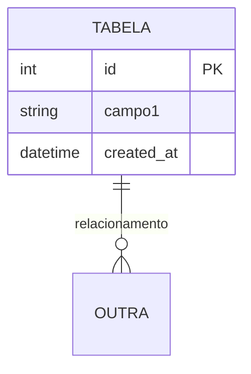
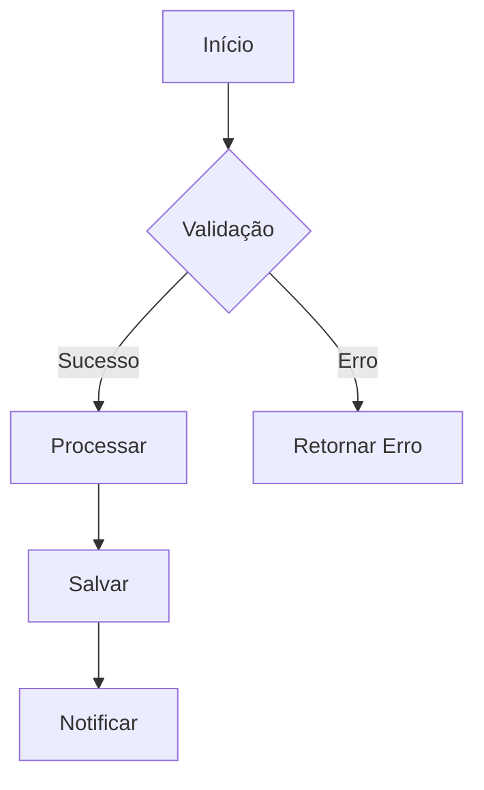
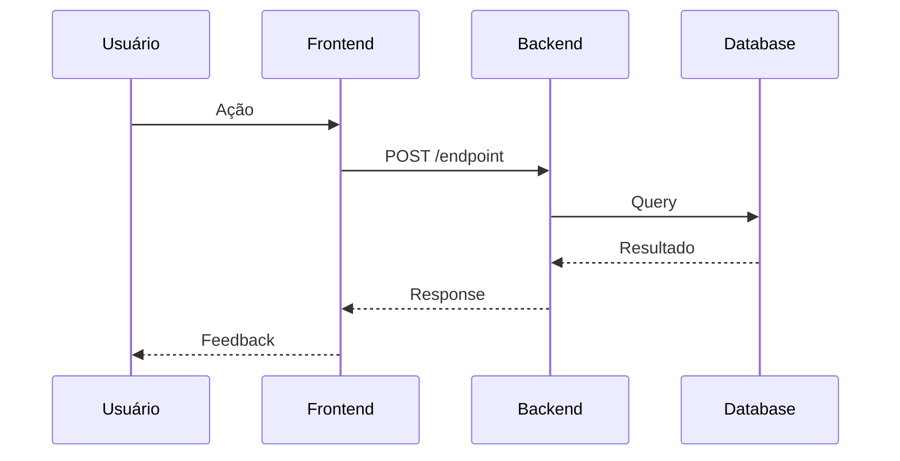

# Template de Geração de PRD - Versão Otimizada

## 🔐 Enforcement do Agent (@prd-writer)

**Regra de Ativação:**
- Sem agent @prd-writer → Responder: "Use o agent @prd-writer para gerar o PRD."
- Múltiplas US → Perguntar qual processar (uma por vez)
- Verificar existência do PRD antes de criar (evitar duplicação)
- Após gerar → Sugerir: "@backend-api implemente USXXX"
- Se BackendStatus = complete → Sugerir: "@frontend-api implemente FRONT items pendentes da USXXX"

---

## 🔴 REGRA FUNDAMENTAL

**UMA USER STORY = UM ARQUIVO PRD**

Processar apenas UMA US por vez. Se receber múltiplas, perguntar: *"Qual user story processar primeiro?"*

Cada PRD deve conter flags: BackendStatus (planned|partial|complete) e FrontendStatus (planned|partial|complete).
Sempre refletir progresso na tabela Implementation Status (não omitir linhas já concluídas).

---

## 📋 Template PRD

```markdown
# PRD - [Nome da User Story]

BackendStatus: planned|partial|complete
FrontendStatus: planned|partial|complete
PRDVersion: v1
PRDDate: YYYY-MM-DD
RelatedPRD: PRD-000X-[slug]
USID: US[NNN]
SourceUserStory: docs/stories/US[NNN]-*.md (ajustar para o caminho real da US geradora)
AcceptanceCriteriaRef: (referência aos critérios na User Story; não duplicar conteúdo)

EffortEstimate:
  backend: "~X horas"  # estimativa objetiva
  frontend: "~Y horas"
  total: "~Z horas/dias"

KPIs (opcional):
  - "Ex: % conversão cadastro"
  - "Ex: tempo médio fluxo <= 30s"

RiscosEMitigacoes (opcional):
  - risco: "Dependência de serviço externo X não definida"
    impacto: "Alto"
    mitigacao: "Mock até definição"
  - risco: "Complexidade de validações aumentar"
    impacto: "Médio"
    mitigacao: "Isolar em validators reutilizáveis"

## Visão Geral

### Objetivo
[O que será desenvolvido, quem usará e qual problema resolve]

### Valor de Negócio
- [Benefício 1]
- [Benefício 2]
- [Benefício 3]

## Sequência de Implementação
(Manter ordem: Base de Dados → Validação → Backend → Frontend → Testes/Doc)

### Task 1: Base de Dados
1. Criar/alterar tabelas necessárias
2. Definir índices e constraints
3. Estabelecer relacionamentos
4. Configurar chaves primárias/estrangeiras

#### Esquema da Tabela


### Task 2: Validação de Dados
1. Criar validadores específicos
2. Implementar regras de formato
3. Desenvolver verificadores de integridade
4. Adicionar validações de negócio

### Task 3: Lógica de Negócio (Backend)
1. Criar endpoint/controller
2. Implementar regras de negócio
3. Adicionar validações server-side
4. Configurar tratamento de erros
5. Garantir autenticação/autorização (JWT / roles se aplicável)

### Task 4: Interface do Usuário (Frontend)
1. Desenvolver componente/tela
2. Criar formulários necessários
3. Implementar feedback visual
4. Garantir responsividade
5. Integrar com endpoints

#### Organização Frontend
**Estrutura por feature:**
- Tipos de dados (request, response, modelos de UI)
- Camada de comunicação HTTP
- Serviços de orquestração e transformação
- Hooks customizados
- Componentes reutilizáveis
- Páginas e containers

**Estratégia de Tipos:**
- Se estrutura de dados da API for idêntica à necessária na UI → Definir tipo único
- Se estruturas forem diferentes → Definir tipo separado para API e UI, documentar necessidade de transformação
- Centralizar definições de tipos por feature

#### UI / Interação
Fornecer visão estrutural SEM detalhar estilos cosméticos:
- ComponentTree:
```
FeatureRoot
  ├─ ListPage
  │   ├─ FilterForm
  │   ├─ EntityTable
  │   └─ Pagination
  └─ FormPage
```
- LayoutRegioes: header / content / footer
- Estados: loading (skeleton n itens), empty (mensagem + CTA), error (toast + retry), success (toast + redirect?)
- AçõesLinha (se aplicável): editar | excluir | inativar (confirm modal)
- Navegacao: listar → criar → salvar → voltar com destaque / scroll to top
- Acessibilidade: foco após sucesso, labels explícitos, aria-live para mensagens

uiSpec (opcional YAML para automação):
```yaml
uiSpec:
  pages:
    - id: list
      route: /entidades
      components:
        - type: table
          id: entidades-table
          columns:
            - key: nome
              label: Nome
              sortable: true
            - key: status
              label: Status
              type: badge
            - key: actions
              label: Ações
              actions: [editar, excluir]
          emptyState:
            message: Nenhum registro encontrado
            primaryAction: criar
          pagination:
            pageSize: 10
    - id: form
      route: /entidades/:id?
      fields:
        - name: nome
          label: Nome
          type: text
          validators: [required, max:100]
      submit:
        successRedirect: /entidades
        toast: Registro salvo com sucesso
```

### Task 5: Testes e Documentação
1. Escrever testes unitários (Domain + Application) – sem testes de integração nesta fase
2. Planejar (opcional) cenários de integração futura se houver dependências externas
3. Documentar API/endpoints
4. Code review e preparar deploy
5. Atualizar Implementation Status (e flags BackendStatus/FrontendStatus)

## API Contracts
| EndpointID | Método | Path (/api/v1/...) | Auth | RequestDTO | ResponseDTO | HTTP Codes |
|------------|--------|--------------------|------|------------|-------------|-----------|
| EP-001 | POST | /api/v1/... | Bearer | CreateXRequest | XResponse | 201,400,401 |

### Contratos de Dados

**DTOs do Backend:**
Documentar estrutura de dados de Request e Response para cada endpoint:
- Nome do DTO
- Campos obrigatórios e opcionais
- Tipo de dado de cada campo
- Formato esperado (ex: ISO 8601 para datas, email válido, etc)

**Tipos do Frontend:**
Documentar estrutura de dados necessária na UI:

**Cenário 1 - Estruturas Idênticas:**
- Quando campos da API coincidem com necessidades da UI
- Documentar tipo único com todos os campos
- Exemplo: Vendedor com campos id, nome, cpf

**Cenário 2 - Estruturas Diferentes:**
- Quando há divergência entre API e UI
- Documentar tipo de resposta da API
- Documentar tipo de modelo para UI
- Listar transformações necessárias:
  - Conversões de tipo (ex: string ISO para objeto Date)
  - Renomeações de campo (ex: usuarioId → id)
  - Campos computados (ex: nomeCompleto a partir de nome + sobrenome)
  - Achatamento de estruturas aninhadas

### Regras de Autorização
| Role | Permissão | EndpointID |
|------|-----------|-----------|
| admin | full | EP-001 |

## Especificações Técnicas

### Validações Obrigatórias
| Campo | Regra | Mensagem de Erro |
|-------|-------|------------------|
| [campo] | [regra] | [mensagem] |

### Implementation Status
(Atualizar sempre que backend ou frontend avançar)
| ItemID | Tipo | Descrição | Responsável | Status | CommitRef |
|--------|------|-----------|-------------|--------|-----------|
| RF-001 | RF | Cadastrar X | backend | done | commit:abc123 |
| EP-001 | ENDPOINT | POST /api/v1/... | backend | done | commit:abc123 |
| DTO-CreateXRequest | DTO | Backend request payload | backend | done | commit:abc123 |
| TYPE-Vendedor | TYPE | Frontend tipo único | frontend | planned | - |
| FRONT-001 | FRONT | Tela formulário X | frontend | planned | - |
| TEST-RF-001-U1 | TEST | Unit create service | backend | done | commit:def456 |

**Legenda Tipos:**
- `RF`: Requisito Funcional
- `ENDPOINT`: Rota da API
- `DTO`: Estrutura de dados do Backend (Request/Response)
- `TYPE`: Definição de tipo de dados do Frontend
- `FRONT`: Item de implementação frontend
- `TEST`: Teste unitário/integração

### Matriz de Rastreabilidade
| RF | Endpoints | DTOs (Backend) | Types (Frontend) | Tests | FRONT Items |
|----|-----------|----------------|------------------|-------|-------------|
| RF-001 | EP-001 | CreateXRequest, XResponse | Vendedor | TEST-RF-001-U1 | FRONT-001 |

### Fluxo de Processo


### Integrações de API


### Critérios de Aceitação
- [ ] [Critério testável 1]
- [ ] [Critério testável 2]
- [ ] [Critério testável 3]

### Riscos & Mitigações (opcional)
| Risco | Impacto | Mitigação |
|-------|---------|-----------|
| Dependência externa não definida | Alto | Mock + tempo limite para definição |
| Aumento de complexidade de validação | Médio | Centralizar em validators reutilizáveis |

### KPIs (opcional)
| KPI | Meta |
|-----|------|
| Tempo médio fluxo | <= 30s |
| Taxa sucesso operação | >= 98% |

### Definition of Done
- [ ] Código revisado e aprovado
- [ ] Testes unitários (Domain/Application) >80% cobertura (integração somente se aprovado explicitamente)
- [ ] Interface responsiva (se houver FRONT items)
- [ ] Validações de segurança implementadas
- [ ] Documentação técnica atualizada
- [ ] Performance validada (<2s resposta)
- [ ] Implementation Status atualizado
- [ ] Flags BackendStatus / FrontendStatus coerentes
- [ ] Regras de negócio consistentes com a User Story fonte
- [ ] Tipos frontend seguem regra: 1 tipo se API === UI, 2 tipos se API ≠ UI (com transformação documentada)

### Changelog
| Data | Versão | Alteração | Autor |
|------|--------|-----------|-------|
| YYYY-MM-DD | v1 | Criação inicial | |

---

## 🎯 Regras de Transformação

### Processamento da User Story
1. **Objetivo** → Extrair "Como/Quero/Para"
2. **Ator** → Identificar usuário baseado no "Como"
3. **Ação** → Mapear funcionalidade do "Quero"
4. **Critérios** → Listar apenas desta US
5. Preencher API Contracts somente com endpoints desta US
6. Se endpoints já implementados (detectar por commit informado pelo usuário) → marcar Status=done e BackendStatus=partial/complete

### Processamento de Regras de Negócio
1. **Reutilizar fielmente** as Regras de Negócio listadas na User Story (não reescrever semanticamente)
2. **Filtrar** → Apenas regras relevantes para esta US
3. **Campos** → Somente os necessários
4. **Validações** → Aplicáveis a esta história
5. **Bloqueios** → Condições específicas
6. Divergência detectada entre Story e interpretação → marcar com ⚠️ e solicitar confirmação

### Mapeamento de Tipos Frontend
**Ao definir tipos TypeScript no PRD:**

1. **Analisar equivalência API ↔ UI:**
   - Se campos **idênticos** → Criar **1 tipo** (ex: `Vendedor`)
   - Se campos **diferentes** → Criar **2 tipos** (ex: `AuthResponse` + `AuthUser`)

2. **Quando criar 2 tipos:**
   - Conversão de tipos (string → Date)
   - Campos computados (fullName = firstName + lastName)
   - Campos extras de UI (isEditing, validationErrors)
   - Normalização de dados (nested → flat)

3. **Documentar no PRD:**
   - Listar tipos em seção "Contratos de Dados - Tipos do Frontend"
   - Adicionar items `TYPE-*` na Implementation Status
   - Se houver transformação → descrever na Task 4 quais campos mudam e por quê
   - Indicar claramente se é cenário 1 ou 2

4. **Formato de documentação:**
   - Nome do tipo
   - Lista de campos com seus tipos de dados
   - Para transformações, descrever:
     - Campo origem (API)
     - Campo destino (UI)
     - Tipo de conversão necessária
     - Justificativa da transformação

### Diretrizes
- Uma US por vez, focada e específica
- Linguagem técnica mas acessível
- Verbos no infinitivo
- Tasks em ordem lógica de dependência
- 3-4 subtarefas por task
- **Sempre incluir diagramas** quando houver operações de banco
- Não redefinir IDs existentes em revisões (manter rastreabilidade)
- Sempre gerar tabela Implementation Status mesmo que todos planned
- Referenciar a fonte da User Story (campo SourceUserStory)
- **Frontend:** Documentar tipos de dados sem duplicação (centralizar por feature)

---

## ⚠️ Tratamento de Ambiguidades

### Cenários Problemáticos

**User Story Ambígua:**
- Listar pontos não claros
- Fazer perguntas específicas: *"O campo X deve aceitar valores nulos?"*
- Sugerir interpretação: *"Entendo que Y significa Z. Correto?"*

**Requisitos Contraditórios:**
```
❌ Conflito detectado:
- Regra A diz: [descrição]
- Critério B diz: [descrição]

📋 Qual deve prevalecer? Ou há uma terceira interpretação?
```

**Informação Insuficiente:**
- Listar lacunas identificadas
- Propor perguntas estruturadas:
  1. Qual o comportamento esperado quando [cenário]?
  2. Existem permissões específicas para [ação]?
  3. Como tratar [caso edge]?

**Escopo Muito Amplo:**
```
🔍 Esta US parece conter múltiplas funcionalidades:
- [Funcionalidade A]
- [Funcionalidade B]
- [Funcionalidade C]

💡 Sugestão: Quebrar em:
- US001: [A]
- US002: [B]
- US003: [C]

Prosseguir com quebra ou manter consolidado?
```

**Conflito entre Regras de Negócio:**
1. Documentar ambas as regras no PRD
2. Marcar seção com ⚠️ REQUER DECISÃO
3. Apresentar opções A/B/C com prós/contras
4. Aguardar definição antes de prosseguir

- Se versão anterior existir → comparar e listar diffs propostas antes de sobrescrever (resumo textual)

## 📊 Checklist de Qualidade Final

Antes de salvar, validar:

### Completude Estrutural
- [ ] Todas as 5 tasks estão presentes
- [ ] Cada task tem 3-4 subtarefas específicas
- [ ] Objetivo claramente definido
- [ ] Valor de negócio articulado (2-3 pontos)
- [ ] Seção API Contracts preenchida (ou explicitamente "N/A")
- [ ] Tabela Implementation Status presente
- [ ] Matriz de Rastreabilidade presente
- [ ] Seção UI / Interação (quando houver FRONT)
- [ ] EffortEstimate preenchido
- [ ] AcceptanceCriteriaRef apontando para Story
- [ ] Tipos Frontend documentados (seguindo regra 1 ou 2 tipos)

### Qualidade Técnica
- [ ] Diagrama ER incluído (se houver BD)
- [ ] Fluxo de processo definido (se complexo)
- [ ] Diagrama de sequência (se houver API)
- [ ] Validações com mensagens de erro
- [ ] Critérios de aceitação testáveis
- [ ] DTOs backend consistentes com API Contracts
- [ ] Tipos frontend consistentes com DTOs backend
- [ ] Mapper documentado quando API ≠ UI (indicar campos que precisam conversão)
- [ ] Riscos & Mitigações avaliados (ou "N/A")
- [ ] KPIs definidos (ou "N/A")

### Especificidade
- [ ] Sem features não solicitadas
- [ ] Sem requisitos ambíguos
- [ ] Sem "TODO" ou placeholders
- [ ] Nomenclatura consistente
- [ ] Flags BackendStatus / FrontendStatus coerentes com tabela
- [ ] Regras transcritas da Story sem alteração semântica
- [ ] UI não inventa fluxos não descritos
- [ ] Tipos frontend não duplicados desnecessariamente

### Sintaxe dos Diagramas
- [ ] Mermaid sintaticamente correto
- [ ] Relacionamentos bem definidos
- [ ] Tipos de dados especificados
- [ ] Chaves primárias marcadas (PK)

### Testabilidade
- [ ] Definition of Done objetiva
- [ ] Critérios mensuráveis
- [ ] Cenários de teste implícitos claros
- [ ] Cada RF possui pelo menos 1 test item planejado ou done

**Pontuação Mínima para Aprovação: 20/23 ✓**

---

## 🗂️ Protocolo PRD (Blocos de Conhecimento)

### Fluxo de Criação

**Sem PRD Ativo:**
```
📦 Informe o nome descritivo do novo PRD (ex: gestao de vendedores):
```

**Cálculo Automático:**
1. Listar `/docs/prd/PRD-*`
2. Extrair máximo numérico
3. Incrementar +1, zero-pad 4 dígitos
4. Gerar slug: lowercase, sem acentos, kebab-case

**Confirmação:**
```
✅ Novo PRD: PRD-0003-gestao-vendedores
📁 Estrutura:
   /docs/prd/PRD-0003-gestao-vendedores/
     US001/
     US002/
     ...

Confirmar criação? (sim/não)
```

**PRD Existente:**
```
📂 PRDs disponíveis:
1. PRD-0001-controle-clientes (3 PRDs)
2. PRD-0002-financeiro-basico (5 PRDs)

Escolher existente (1-2) ou criar novo (0)?
```

### Validações do Nome
- ❌ Nome vazio → Pedir novamente
- ❌ Slug vazio após normalização → Pedir nome válido
- ✂️ Slug >60 chars → Truncar em palavra completa
- ✅ Slug válido → Prosseguir

### Estrutura Final
```
/docs/product-requirements/
  PRD-0003-gestao-vendedores/
    US001/
      PRD-US001-cadastrar-vendedor-2025-10-01.md
    US002/
      PRD-US002-editar-vendedor-2025-10-01.md
```

---

## 💾 Instruções de Salvamento

### Nome do Arquivo
```
PRD-US[NNN]-[nome-funcionalidade]-YYYY-MM-DD.md
```

**Versionamento:** Se existir na mesma data → `-v2`, `-v3`...

### Confirmação Pós-Salvamento
```
✅ PRD da US001 salvo em:
📁 /docs/product-requirements/PRD-0003-gestao-vendedores/US001/PRD-US001-cadastrar-vendedor-2025-10-01.md

Próxima ação:
1. Gerar outro PRD (neste PRD)
2. Criar novo PRD
3. Encerrar

Escolha (1/2/3):
```

- Em revisões: incrementar PRDVersion e adicionar linha ao Changelog

---

## 🎯 Métricas de Sucesso do PRD

Um PRD de qualidade deve:
- ✅ Ser implementável sem perguntas adicionais
- ✅ Ter critérios de aceitação objetivos
- ✅ Incluir diagramas claros e corretos
- ✅ Definir validações completas
- ✅ Mapear fluxos de forma visual
- ✅ Passar no checklist de qualidade (≥20/23)
- ✅ Permitir agente backend marcar backend como complete sem ambiguidade
- ✅ Permitir agente frontend identificar FRONT-* com status planned
- ✅ Documentar tipos frontend sem duplicação desnecessária

**Tempo estimado de implementação:** Inferir com base na complexidade e incluir no PRD.

---

## 📌 Notas Finais

- Inferir contexto quando necessário, mas manter conservadorismo
- Sempre incluir tasks de teste e documentação
- Ordem lógica: BD → Validações → Backend → Frontend → Testes → Deploy
- Consistência entre regras de negócio e validações técnicas
- **Em caso de dúvida, sempre perguntar antes de assumir**
- Nunca remover linhas done da Implementation Status (histórico local)
- Commits devem seguir Conventional Commits; referenciar IDs (ex: feat(api): implement EP-001 RF-001)
- **Frontend:** Documentar tipos de dados centralizados por feature sem duplicação
- **Transformações:** Documentar explicitamente quando estruturas de API e UI divergirem
- **Validações:** Incluir regras de validação tanto para backend quanto frontend