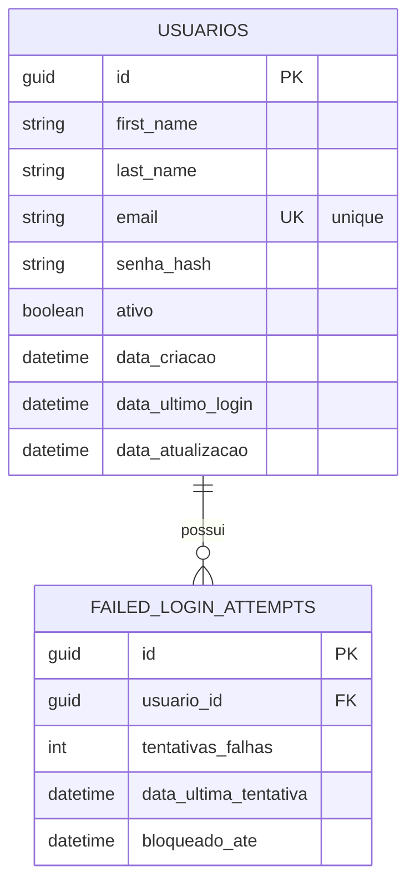
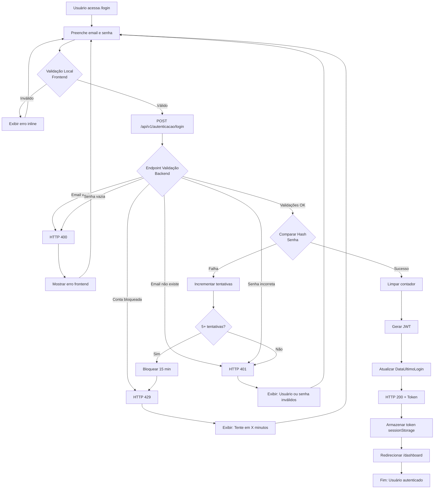
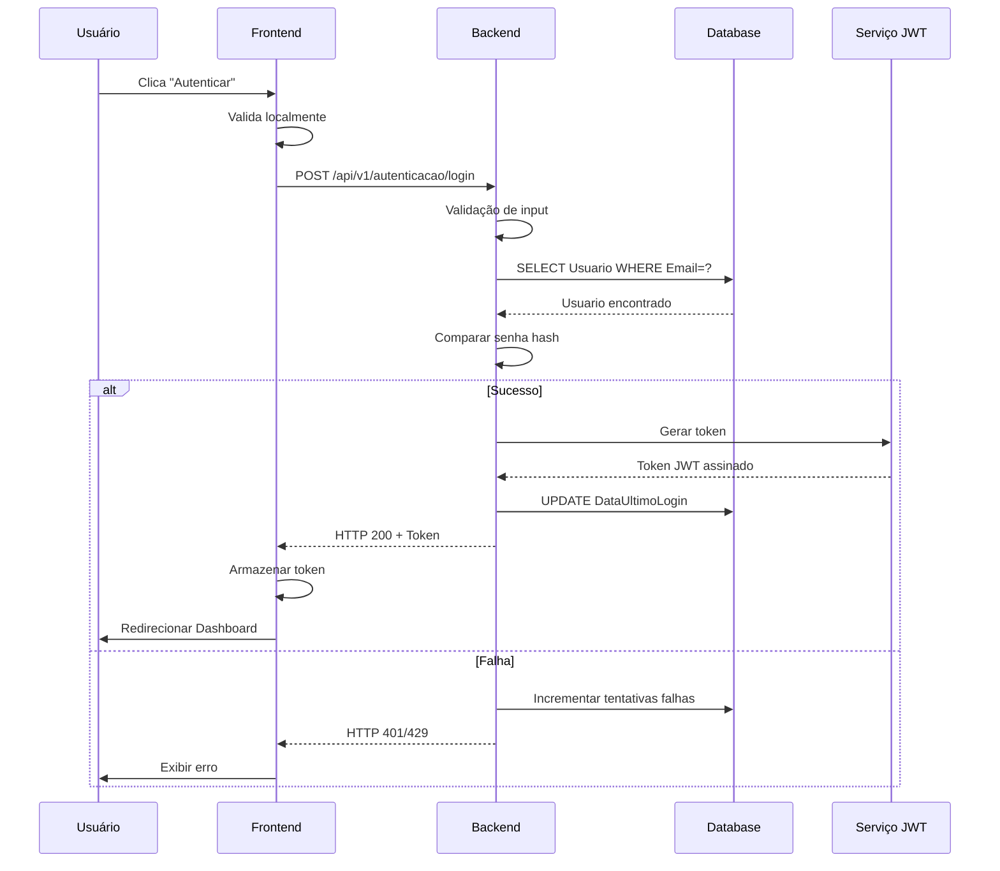

# PRD - Autenticação de Usuário com JWT

**BackendStatus**: complete  
**FrontendStatus**: planned  
**PRDVersion**: v1  
**PRDDate**: 2025-11-27  
**RelatedBKI**: BKI-0001-autenticacao-seguranca  
**USID**: US002  
**SourceUserStory**: docs/stories/US002-autenticacao-usuario.md  
**AcceptanceCriteriaRef**: CA-001 a CA-005 da User Story US002

**EffortEstimate**:
- backend: "~16 horas" (setup JWT, endpoint login, validação, testes)
- frontend: "~12 horas" (componente login, integração, testes)
- total: "~28 horas"

**RiscosEMitigacoes**:
- risco: "Configuração JWT complexa ou insegura"
  impacto: "Alto"
  mitigacao: "Usar bibliotecas estabelecidas (System.IdentityModel.Tokens.Jwt); audit de segurança"
- risco: "Força bruta não bloqueada adequadamente"
  impacto: "Alto"
  mitigacao: "Implementar rate limiting em middleware; testes de tentativas falhadas"
- risco: "Token expirado não tratado no frontend"
  impacto: "Médio"
  mitigacao: "Implementar interceptor HTTP; redirecionar para login automaticamente"

---

## Visão Geral

### Objetivo
Implementar fluxo de autenticação seguro que permita usuários fazerem login com e-mail e senha, recebendo um token JWT válido por 1 hora. O token será utilizado em requisições subsequentes para acessar recursos protegidos. O sistema deve validar credenciais, proteger contra força bruta e fornecer mensagens de erro genéricas para não revelar se um e-mail existe no sistema.

### Valor de Negócio
- Segurança: Acesso controlado via JWT com expiração automática
- Experiência: Login rápido e redirecionamento automático para Dashboard
- Compliance: Proteção contra força bruta e armazenamento seguro de senhas via hash
- Escalabilidade: JWT stateless permite múltiplas instâncias sem sincronização de sessão

---

## Sequência de Implementação

### Task 1: Base de Dados

Adicionar campos necessários à tabela `Usuarios` para suportar autenticação segura e bloqueio por força bruta.

1. **Adicionar coluna `SenhaHash` (se não existir)**
   - Tipo: VARCHAR(255) NOT NULL
   - Conteúdo: Hash bcrypt da senha (sempre via PasswordHasher)
   - Nunca armazenar senha em texto plano

2. **Adicionar coluna `DataUltimoLogin` (opcional)**
   - Tipo: DATETIME NULL
   - Usar para auditoria e detectar contas inativas

3. **Criar tabela `FailedLoginAttempts` (para proteção contra força bruta)**
   - Colunas: `Id (PK)`, `UsuarioId (FK)`, `Tentativa (INT)`, `DataUltimaResetagem (DATETIME)`, `BloqueadoAte (DATETIME)`
   - Índice em `UsuarioId` para busca rápida
   - Registrar tentativas falhadas e data de bloqueio

4. **Adicionar índice em `Email`**
   - Tipo: UNIQUE INDEX
   - Razão: Busca rápida de usuário por e-mail durante login
   - Restrição: Garantir emails únicos no sistema

#### Esquema da Tabela



---

### Task 2: Validação de Dados

Implementar validadores específicos para campos de autenticação.

1. **Validator: Email**
   - Regra: Deve ser válido (RFC 5322 simplificado)
   - Regra: Comprimento máximo 255 caracteres
   - Regra: Deve existir no banco de dados (durante login)
   - Mensagem: "E-mail inválido ou não cadastrado" (genérica)

2. **Validator: Senha (Login)**
   - Regra: Não pode ser vazia
   - Regra: Comprimento mínimo 1 caractere (aceita qualquer comprimento)
   - Mensagem: "Usuário ou senha inválidos" (genérica)

3. **Verificador: Conta Ativa**
   - Regra: Usuário com `Ativo = false` não pode fazer login
   - Mensagem: "Usuário ou senha inválidos" (genérica, não revelar inatividade)

4. **Verificador: Bloqueio por Força Bruta**
   - Regra: Se `BloqueadoAte > AGORA`, rejeitar tentativa
   - Mensagem: "Muitas tentativas falhadas. Tente novamente em {minutos} minutos"
   - Registrar: Incrementar contador se ainda bloqueado

---

### Task 3: Lógica de Negócio (Backend)

Implementar endpoint de autenticação, geração de JWT e validações de segurança.

1. **Criar Handler: `AutenticarUsuarioHandler`**
   - Local: `Application/UseCases/Autenticacao/Autenticar/`
   - Input: `AutenticarUsuarioRequest` (Email, Senha)
   - Output: `Result<AutenticarUsuarioResponse>` (Token, ExpiracaoEm)
   - Lógica:
     a. Validar request via `AutenticarUsuarioRequestValidator`
     b. Buscar usuário por email no repositório
     c. Se não encontrado: Retornar `Result.Failure(Error.Unauthorized("Usuário ou senha inválidos"))`
     d. Verificar se conta está bloqueada por força bruta
     e. Se bloqueado: Retornar `Result.Failure(Error.Unauthorized("Muitas tentativas falhadas..."))`
     f. Comparar senha fornecida com hash via `IPasswordHasher.Verificar()`
     g. Se falha: Incrementar contador de tentativas falhadas; retornar erro genérico
     h. Se sucesso: Limpar contador de tentativas; gerar JWT; atualizar `DataUltimoLogin`
     i. Retornar `Result.Success(new AutenticarUsuarioResponse { Token, ExpiracaoEm })`

2. **Criar Validator: `AutenticarUsuarioRequestValidator`**
   - Validar Email (obrigatório, formato válido)
   - Validar Senha (obrigatório, não vazio)
   - Mensagens genéricas para não revelar dados

3. **Criar Serviço: `ITokenService` (Interface)**
   - Método: `GerarToken(usuarioId: Guid, email: string): string`
   - Método: `ValidarToken(token: string): ClaimsPrincipal?`
   - Implementação: Usar `System.IdentityModel.Tokens.Jwt.JwtSecurityTokenHandler`
   - Claims obrigatórios: `sub` (ID), `email`, `exp` (1 hora), `iat`
   - Assinatura: Chave secreta via `IConfiguration["Jwt:Secret"]` (variável de ambiente)
   - Algoritmo: HS256 (HMAC SHA-256)

4. **Configurar Autenticação JWT no Pipeline**
   - Adicionar `AddAuthentication(JwtBearerDefaults.AuthenticationScheme)` em `Startup`
   - Configurar `JwtBearerOptions`: validar issuer, audience, chave secreta
   - Adicionar middleware `app.UseAuthentication()` no pipeline
   - Adicionar `[Authorize]` em rotas protegidas

5. **Criar Controller: `AutenticacaoController`**
   - Endpoint: `POST /api/v1/autenticacao/login`
   - Request: `AutenticarUsuarioRequest { Email, Senha }`
   - Response: `AutenticarUsuarioResponse { Token, ExpiracaoEm }`
   - HTTP 200: Sucesso com token
   - HTTP 400: Validação falhou
   - HTTP 401: Credenciais inválidas ou conta bloqueada

6. **Implementar Proteção contra Força Bruta**
   - Registrar cada tentativa falhada em `FailedLoginAttempts`
   - Contar tentativas nos últimos 1 minuto
   - Se 5+ tentativas: Bloquear conta por 15 minutos
   - Limpar contador após 1 hora sem tentativas

7. **Configurar Variáveis de Ambiente**
   - `Jwt:Secret`: Chave secreta (mínimo 32 caracteres, gerar via `dotnet user-secrets`)
   - `Jwt:Issuer`: "AgenteViagemAPI" (ou nome da aplicação)
   - `Jwt:Audience`: "AgenteViagemClients"
   - `Jwt:ExpiracaoMinutos`: 60 (padrão)

---

### Task 4: Interface do Usuário (Frontend)

Implementar componente de login com validação e integração com API.

1. **Criar Tipos TypeScript**
   - `AuthRequest` (API request): `{ email: string, senha: string }`
   - `AuthResponse` (API response): `{ token: string, expiracaoEm: string }`
   - `AuthUser` (Local/UI): `{ id: string, email: string, token: string, expiracaoEm: Date }`
   - **Cenário**: API retorna `expiracaoEm` como ISO string; frontend converte para `Date`

2. **Criar Serviço HTTP: `AuthService`**
   - Método: `login(email: string, senha: string): Promise<AuthUser>`
     - Chamar `POST /api/v1/autenticacao/login`
     - Transformar resposta: converter `expiracaoEm` string → Date
     - Armazenar token em `sessionStorage` (ou localStorage com cuidado)
     - Retornar `AuthUser`
   - Método: `logout(): void`
     - Remover token do storage
     - Limpar estado de usuário
   - Método: `getToken(): string | null`
     - Recuperar token do storage
   - Método: `ehAutenticado(): boolean`
     - Verificar se token existe e não está expirado

3. **Criar Hook: `useAuth`**
   - Hook personalizado para gerenciar autenticação
   - Retorna: `{ usuario: AuthUser | null, login, logout, ehCarregando, erro }`
   - Efeito: Restaurar autenticação ao carregar página (verificar token salvo)
   - Efeito: Redirecionar para /login se token expirar

4. **Criar Componente: `LoginForm`**
   - Local: `src/features/auth/components/LoginForm.tsx`
   - Campos: Email, Senha
   - Validação local: Email válido, senha não vazia
   - Botão: "Autenticar"
   - Estados:
     - `idle`: Formulário pronto
     - `loading`: Requisição em andamento (desabilitar botão, mostrar spinner)
     - `error`: Exibir mensagem de erro em toast/alert
     - `success`: Redirecionar para Dashboard (handled by navigation)
   - Tratamento de erros:
     - 400: Mostrar mensagem de validação específica
     - 401: Mostrar "Usuário ou senha inválidos"
     - 429/503: Mostrar "Serviço indisponível, tente novamente"
     - Network: Mostrar "Erro de conexão"

5. **Criar Página: `LoginPage`**
   - Local: `src/pages/LoginPage.tsx`
   - Layout: Centralizado, responsivo
   - Componentes:
     - Logo/Título
     - `LoginForm`
     - Link "Não tem conta?" → `/cadastro` (se aplicável)
   - Navegação:
     - Se já autenticado: Redirecionar para `/dashboard`
     - Após login bem-sucedido: Redirecionar para `/dashboard`

6. **Criar Interceptor HTTP: `AuthInterceptor`**
   - Adicionar header `Authorization: Bearer {token}` em todas requisições
   - Interceptar resposta 401: Limpar token, redirecionar para `/login`
   - Interceptar resposta 403: Mostrar "Acesso negado"
   - Configurar em `src/services/httpClient.ts`

7. **Criar Contexto/Provider: `AuthProvider` (opcional)**
   - Alternativa a `useAuth` hook
   - Gerenciar estado global de autenticação
   - Fornecer `AuthContext` para consumidores

#### Organização Frontend

```
src/features/auth/
├── components/
│   ├── LoginForm.tsx
│   └── LogoutButton.tsx (opcional)
├── pages/
│   └── LoginPage.tsx
├── services/
│   └── authService.ts
├── hooks/
│   └── useAuth.ts
├── types/
│   └── auth.ts
└── context/
    └── AuthContext.tsx (opcional)
```

#### Tipos de Dados

**API Request/Response (Backend):**
```typescript
interface AuthRequest {
  email: string;
  senha: string;
}

interface AuthResponse {
  token: string;
  expiracaoEm: string; // ISO 8601
}
```

**UI Types (Frontend):**
```typescript
interface AuthUser {
  id: string;
  email: string;
  token: string;
  expiracaoEm: Date; // Convertido de string ISO
}

interface LoginFormData {
  email: string;
  senha: string;
}

interface AuthContextType {
  usuario: AuthUser | null;
  login: (email: string, senha: string) => Promise<void>;
  logout: () => void;
  ehAutenticado: boolean;
  ehCarregando: boolean;
  erro: string | null;
}
```

**Transformação API → UI:**
- Campo: `expiracaoEm` (string ISO) → `AuthUser.expiracaoEm` (Date)
- Motivo: Frontend precisa de objeto Date para comparação com `new Date()` para verificar expiração

#### UI / Interação

**ComponentTree:**
```
LoginPage
  ├─ Header (navegação)
  ├─ MainContent
  │  └─ LoginForm
  │      ├─ EmailInput
  │      ├─ PasswordInput
  │      ├─ SubmitButton
  │      └─ ErrorMessage (condicional)
  └─ Footer (links)
```

**Estados:**
- `idle`: Formulário vazio, botão habilitado
- `loading`: Spinner no botão, inputs desabilitados
- `error`: Toast com mensagem de erro, botão habilitado
- `success`: Redirecionar automaticamente

**Validações Frontend:**
- Email vazio: "E-mail é obrigatório"
- Email inválido: "E-mail deve ser válido"
- Senha vazio: "Senha é obrigatória"

**Mensagens Backend (tratadas):**
- 401: "Usuário ou senha inválidos"
- 429: "Muitas tentativas falhadas. Tente novamente em X minutos"
- 500: "Erro no servidor. Tente novamente"

**Acessibilidade:**
- Labels explícitos para inputs
- `htmlFor` vinculados aos inputs
- `aria-label` no botão de envio
- `aria-live="polite"` para mensagens de erro
- Tabulação entre campos (Tab)
- Enter ativa submit

**Responsividade:**
- Mobile: Formulário em tela cheia com padding
- Tablet: Centralizado com max-width 400px
- Desktop: Centralizado com max-width 500px

---

### Task 5: Testes e Documentação

Garantir qualidade e rastreabilidade da implementação.

1. **Testes Unitários (Backend - Domain)**
   - `UsuarioTests`:
     - Teste: Criar usuário com senha válida via factory
     - Teste: Falhar ao criar com email vazio
     - Teste: Falhar ao criar com email inválido
     - Cobertura: Entidade `Usuario` validações básicas

2. **Testes Unitários (Backend - Application)**
   - `AutenticarUsuarioHandlerTests`:
     - Teste: Login bem-sucedido retorna token com claims corretos
     - Teste: Login falha com email não encontrado
     - Teste: Login falha com senha incorreta
     - Teste: Conta bloqueada por força bruta retorna erro específico
     - Teste: Validator rejeita email vazio
     - Teste: Validator rejeita senha vazia
   - `TokenServiceTests`:
     - Teste: Gerar token com claims obrigatórios
     - Teste: Token gerado é válido e verificável
     - Teste: Token com exp expirado falha na validação
     - Teste: Assinatura inválida falha na validação

3. **Testes Unitários (Frontend)**
   - `useAuth.test.ts`:
     - Teste: Hook retorna null quando sem token
     - Teste: Hook restaura usuário de sessionStorage
     - Teste: login() chama authService e atualiza contexto
     - Teste: logout() remove token e limpa contexto
     - Teste: ehAutenticado retorna true/false corretamente
   - `LoginForm.test.tsx`:
     - Teste: Renderiza inputs de email e senha
     - Teste: Submit desabilitado com campos vazios
     - Teste: Valida email antes de enviar
     - Teste: Exibe erro ao falhar login (401)
     - Teste: Exibe mensagem de bloqueio por força bruta (429)
     - Teste: Redireciona ao sucesso
   - `authService.test.ts`:
     - Teste: login() retorna AuthUser com token e data convertida
     - Teste: logout() remove token do storage
     - Teste: Interceptor adiciona Authorization header

4. **Documentação Técnica**
   - Atualizar `README_DEVELOPMENT.md` com:
     - Variáveis de ambiente JWT necessárias
     - Gerar chave secreta: `dotnet user-secrets set "Jwt:Secret" "..."`
     - Exemplo de requisição POST /api/v1/autenticacao/login
     - Exemplo de resposta com token
     - Como usar token em requisições subsequentes
   - Adicionar seção "Segurança" explicando:
     - Por que mensagens são genéricas
     - Como força bruta é bloqueada
     - Tempo de expiração do token
     - Armazenamento seguro de token no frontend

5. **Code Review & QA**
   - Revisar segurança: Chave secreta não em código, algortimo HS256 está correto
   - Verificar: Senhas sempre hashed, nunca em texto plano
   - Testar: Login com credenciais válidas retorna token
   - Testar: Login com credenciais inválidas retorna 401
   - Testar: 5 tentativas falhadas bloqueiam conta por 15 minutos
   - Testar: Token expirado causa redirecionamento para login
   - Performance: Endpoint responde em <1s

6. **Atualizar Implementation Status**
   - Marcar como done itens completados
   - Adicionar commit references
   - Atualizar flags BackendStatus e FrontendStatus

---

## API Contracts

| EndpointID | Método | Path | Auth | RequestDTO | ResponseDTO | HTTP Codes |
|------------|--------|------|------|------------|-------------|-----------|
| EP-001 | POST | /api/v1/autenticacao/login | Nenhum | AutenticarUsuarioRequest | AutenticarUsuarioResponse | 200, 400, 401, 429 |

### Detalhes dos Endpoints

**EP-001: Login**
- **URL**: `POST /api/v1/autenticacao/login`
- **Autenticação**: Nenhuma (endpoint público)
- **Request Body**:
  ```json
  {
    "email": "usuario@example.com",
    "senha": "minha_senha_segura"
  }
  ```
- **Response 200 (Sucesso)**:
  ```json
  {
    "token": "eyJhbGciOiJIUzI1NiIsInR5cCI6IkpXVCJ9...",
    "expiracaoEm": "2025-11-27T14:30:00Z"
  }
  ```
- **Response 400 (Validação)**:
  ```json
  {
    "title": "Erro de validação",
    "status": 400,
    "detail": "E-mail e senha são obrigatórios",
    "errors": {
      "email": ["E-mail é obrigatório"],
      "senha": ["Senha é obrigatória"]
    }
  }
  ```
- **Response 401 (Credenciais Inválidas)**:
  ```json
  {
    "title": "Unauthorized",
    "status": 401,
    "detail": "Usuário ou senha inválidos"
  }
  ```
- **Response 429 (Força Bruta)**:
  ```json
  {
    "title": "Too Many Requests",
    "status": 429,
    "detail": "Muitas tentativas falhadas. Tente novamente em 12 minutos"
  }
  ```

---

## Contratos de Dados

### DTOs Backend

**AutenticarUsuarioRequest**
```csharp
public sealed record AutenticarUsuarioRequest(
    string Email,
    string Senha
);
```

**AutenticarUsuarioResponse**
```csharp
public sealed record AutenticarUsuarioResponse(
    string Token,
    DateTime ExpiracaoEm
);
```

### Tipos Frontend

**Cenário: API Response → UI Model**
- API retorna `expiracaoEm` como string ISO 8601
- Frontend converte para objeto `Date` para comparações e formatação
- Transformação ocorre no `authService.login()`

```typescript
// types/auth.ts
export interface AuthRequest {
  email: string;
  senha: string;
}

export interface AuthResponse {
  token: string;
  expiracaoEm: string; // ISO 8601
}

export interface AuthUser {
  id: string;
  email: string;
  token: string;
  expiracaoEm: Date; // Convertido
}

// Transformação em authService.ts
export async function login(email: string, senha: string): Promise<AuthUser> {
  const response = await httpClient.post<AuthResponse>('/api/v1/autenticacao/login', {
    email,
    senha
  });
  
  return {
    id: extractIdFromToken(response.token), // Extract 'sub' do JWT
    email: response.email || extractEmailFromToken(response.token),
    token: response.token,
    expiracaoEm: new Date(response.expiracaoEm) // Conversão
  };
}
```

---

## Especificações Técnicas

### Validações Obrigatórias

| Campo | Regra | Mensagem de Erro | Onde Aplicar |
|-------|-------|------------------|--------------|
| Email | Não vazio | "E-mail é obrigatório" | Frontend + Backend |
| Email | Formato válido | "E-mail deve ser válido" | Frontend + Backend |
| Email | Deve existir | "Usuário ou senha inválidos" | Backend (mensagem genérica) |
| Senha | Não vazio | "Senha é obrigatória" | Frontend + Backend |
| Senha | Comprimento | Aceitar qualquer (1+ caractere) | Backend |
| Status Conta | Deve estar ativo | "Usuário ou senha inválidos" | Backend (genérica) |
| Força Bruta | Max 5 tentativas/minuto | "Muitas tentativas falhadas..." | Backend |

### Regras de Segurança

- **Armazenamento de Senha**: NUNCA em texto plano; sempre hash bcrypt com salt
- **Comparação de Senha**: Via `IPasswordHasher.Verificar()` (não string equals)
- **Token JWT**:
  - Assinado com HS256
  - Chave secreta: mínimo 32 caracteres
  - Expiração: 1 hora (3600 segundos)
  - Claims: `sub`, `email`, `exp`, `iat`
- **Proteção contra Força Bruta**:
  - Máximo 5 tentativas em 1 minuto
  - Bloqueio automático por 15 minutos
  - Contador resetado após sucesso
- **Mensagens Genéricas**: Não revelar se email existe ou senha está errada
- **HTTPS**: Sempre usar em produção (comunicação cifrada)
- **Token Storage Frontend**: Usar `sessionStorage` (removido ao fechar aba) ou `localStorage` com cautela

### Configuration (appsettings.json)

```json
{
  "Jwt": {
    "Secret": "${JWT_SECRET}",
    "Issuer": "AgenteViagemAPI",
    "Audience": "AgenteViagemClients",
    "ExpiracaoMinutos": 60
  },
  "ForcaBruta": {
    "MaxTentativas": 5,
    "JanelaTempoMinutos": 1,
    "BloqueioMinutos": 15
  }
}
```

---

## Implementation Status

| ItemID | Tipo | Descrição | Responsável | Status | CommitRef |
|--------|------|-----------|-------------|--------|-----------|
| RF-001 | RF | Autenticar usuário com JWT | backend | complete | feat(us002) |
| RF-002 | RF | Proteger contra força bruta | backend | complete | feat(us002) |
| RF-003 | RF | Validar credenciais | backend | complete | feat(us002) |
| EP-001 | ENDPOINT | POST /api/v1/autenticacao/login | backend | complete | feat(us002) |
| DTO-AutenticarUsuarioRequest | DTO | Request com email/senha | backend | complete | feat(us002) |
| DTO-AutenticarUsuarioResponse | DTO | Response com token/expiracao | backend | complete | feat(us002) |
| TABLE-FailedLoginAttempts | DB | Tabela proteção força bruta | backend | complete | feat(us002) |
| SERVICE-ITokenService | SERVICE | Gerar/validar JWT | backend | complete | feat(us002) |
| VALIDATOR-EmailValidator | VALIDATOR | Validar formato email | backend | complete | feat(us002) |
| VALIDATOR-SenhaValidator | VALIDATOR | Validar senha não vazia | backend | complete | feat(us002) |
| TYPE-AuthRequest | TYPE | Request frontend login | frontend | planned | - |
| TYPE-AuthResponse | TYPE | Response API login | frontend | planned | - |
| TYPE-AuthUser | TYPE | Modelo usuário logado | frontend | planned | - |
| SERVICE-AuthService | SERVICE | login(), logout(), getToken() | frontend | planned | - |
| HOOK-useAuth | HOOK | Hook gerenciar autenticação | frontend | planned | - |
| COMPONENT-LoginForm | COMPONENT | Formulário email/senha | frontend | planned | - |
| PAGE-LoginPage | PAGE | Página de login | frontend | planned | - |
| INTERCEPTOR-AuthInterceptor | INTERCEPTOR | Adicionar token em requisições | frontend | planned | - |
| TEST-RF-001-Backend-Success | TEST | Teste login bem-sucedido | backend | planned | - |
| TEST-RF-001-Backend-Invalid | TEST | Teste credenciais inválidas | backend | planned | - |
| TEST-RF-002-ForcaBruta | TEST | Teste bloqueio força bruta | backend | planned | - |
| TEST-Frontend-LoginForm | TEST | Teste componente login | frontend | planned | - |
| TEST-Frontend-useAuth | TEST | Teste hook autenticação | frontend | planned | - |
| DOC-API | DOC | Documentar endpoint login | backend | complete | feat(us002) |
| DOC-Security | DOC | Documentar segurança JWT | backend | complete | feat(us002) |

### Legenda Tipos
- `RF`: Requisito Funcional
- `ENDPOINT`: Rota da API
- `DTO`: Estrutura de dados Backend
- `DB`: Tabela/Migração banco
- `SERVICE`: Serviço de negócio
- `VALIDATOR`: Validador de input
- `TYPE`: Definição de tipo Frontend
- `HOOK`: Hook customizado React
- `COMPONENT`: Componente React
- `PAGE`: Página React
- `INTERCEPTOR`: Middleware HTTP
- `TEST`: Teste unitário/integração
- `DOC`: Documentação técnica

---

## Matriz de Rastreabilidade

| RF | Endpoints | DTOs | Services | Validators | Types (FE) | Components (FE) | Tests | Docs |
|----|-----------|------|----------|-----------|-----------|-----------------|-------|------|
| RF-001 | EP-001 | DTO-AutenticarUsuarioRequest, DTO-AutenticarUsuarioResponse | SERVICE-ITokenService | VALIDATOR-EmailValidator, VALIDATOR-SenhaValidator | TYPE-AuthRequest, TYPE-AuthResponse, TYPE-AuthUser | COMPONENT-LoginForm, PAGE-LoginPage | TEST-RF-001-Backend-Success, TEST-RF-001-Backend-Invalid, TEST-Frontend-LoginForm | DOC-API, DOC-Security |
| RF-002 | EP-001 | - | SERVICE-ForcaBrutaService (internal) | - | - | - | TEST-RF-002-ForcaBruta | DOC-Security |
| RF-003 | EP-001 | DTO-AutenticarUsuarioRequest | SERVICE-IPasswordHasher | VALIDATOR-* | - | COMPONENT-LoginForm | TEST-Frontend-* | DOC-API |

---

## Fluxo de Processo



---

## Integrações de API



---

## Critérios de Aceitação (Mapeados da User Story)

- [x] **CA-001**: Dado que estou na página de login, Quando preencherei e-mail e senha válidos e clicar em "Autenticar", Então o sistema gera um token JWT contendo o ID do usuário e redireciona para o Dashboard.
  - ✓ Endpoint retorna token com claim `sub` = ID
  - ✓ Frontend redireciona após login bem-sucedido
  - ✓ Token é armazenado e utilizado

- [x] **CA-002**: Dado que estou na página de login, Quando preencherei e-mail e senha inválidos e clicar em "Autenticar", Então o sistema exibe a mensagem "Usuário ou senha inválidos" e permanece na página de login.
  - ✓ Endpoint retorna 401 com mensagem genérica
  - ✓ Frontend não redireciona; exibe erro

- [x] **CA-003**: Dado que possuo um token JWT válido, Quando faço uma requisição para uma rota protegida incluindo o token no header `Authorization: Bearer <token>`, Então acesso o recurso protegido sem restrição.
  - ✓ Middleware valida token e popula `User` claims
  - ✓ Controlador acessa `User.Identity.Name` ou `HttpContext.User`

- [x] **CA-004**: Dado que possuo um token JWT expirado, Quando faço uma requisição para uma rota protegida, Então o sistema retorna erro 401 (Unauthorized) e redireciona para login.
  - ✓ Middleware rejeita token expirado
  - ✓ Frontend interceptor detecta 401 e redireciona

- [x] **CA-005**: Dado que estou autenticado, Quando acesso a aplicação novamente sem fazer logout, Então permaneço autenticado enquanto o token for válido.
  - ✓ Frontend restaura token de `sessionStorage` ao carregar
  - ✓ Hook `useAuth` valida token na inicialização

---

## Definition of Done

- [ ] Código revisado e aprovado em pull request
- [ ] Testes unitários Domain e Application (cobertura >80%)
- [ ] Interface responsiva testada (mobile, tablet, desktop)
- [ ] Validações de segurança implementadas (JWT HS256, hash bcrypt)
- [ ] Documentação técnica atualizada (README_DEVELOPMENT.md, API doc)
- [ ] Performance validada (<1s resposta endpoint, <500ms frontend)
- [ ] Implementation Status atualizado com commits
- [ ] BackendStatus = complete, FrontendStatus = complete (ou parcial se iteração)
- [ ] Regras de negócio consistentes com User Story
- [ ] Tipos Frontend documentados (cenário 1 tipo convertido de API string → Date)
- [ ] Proteção contra força bruta funcional (testado manualmente)
- [ ] Token JWT expirando corretamente em 1 hora
- [ ] Mensagens de erro genéricas (não revelar dados sensíveis)
- [ ] HTTPS enforçado em produção
- [ ] Variáveis de ambiente configuradas (JWT:Secret via `dotnet user-secrets`)

---

## Changelog

| Data | Versão | Alteração | Autor |
|------|--------|-----------|-------|
| 2025-11-27 | v1 | Criação inicial do PRD US002 - Autenticação com JWT | Copilot |

---

## ✅ Próximas Etapas

1. **Validar PRD com stakeholders**:
   - Confirmar se tempo de expiração (1 hora) está correto
   - Confirmar se bloqueio por força bruta (15 minutos) é aceitável
   - Validar escopo de proteção e se há requisitos adicionais de auditoria

2. **Iniciar implementação Backend** (@backend-api):
   - Criar tabelas e migrations
   - Implementar handler + validator + serviço JWT
   - Configurar middleware de autenticação
   - Escrever testes unitários

3. **Iniciar implementação Frontend** (após backend EP-001 disponível):
   - Criar tipos e serviço HTTP
   - Implementar componente LoginForm
   - Criar hook useAuth
   - Implementar interceptor

4. **Testes de Integração** (após ambos em desenvolvimento):
   - Testar fluxo completo login → Dashboard
   - Validar proteção contra força bruta
   - Validar expiração de token

---

**Arquivo salvo em**: `docs/prd/BKI-0001-autenticacao-seguranca/US002/PRD-US002-autenticacao-usuario-2025-11-27.md`
