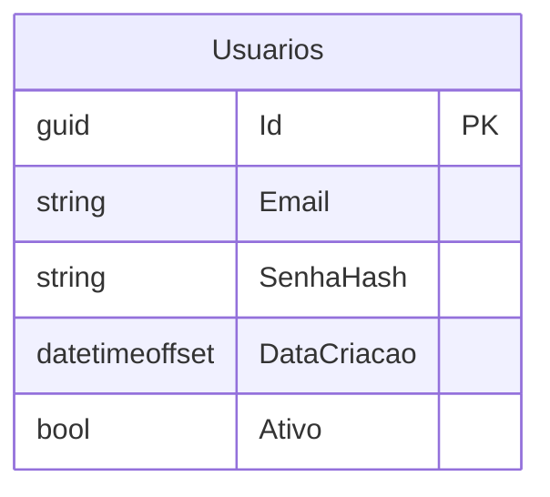
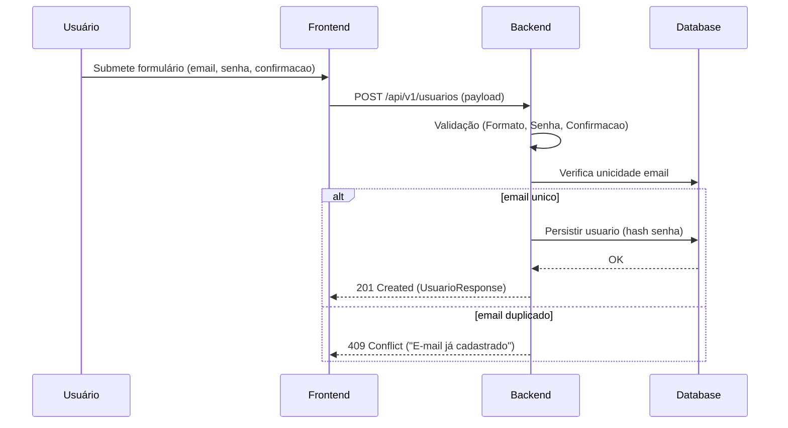

# PRD - Cadastro de Usuário

BackendStatus: planned
FrontendStatus: planned
PRDVersion: v1
PRDDate: 2025-11-25
RelatedBKI: BKI-0001-gestao-usuarios
USID: US001
SourceUserStory: docs/stories/US001-cadastro-usuario.md
AcceptanceCriteriaRef: Ver `docs/stories/US001-cadastro-usuario.md` (Critérios de Aceitação listados lá)

EffortEstimate:
  backend: "~4-6 horas"
  frontend: "~4-8 horas"
  total: "~1-2 dias"

KPIs:
  - "Taxa de conversão de registro >= 60% (meta inicial)"
  - "Erros de validação exibidos corretamente em >99% dos casos válidos"

RiscosEMitigacoes:
  - risco: "Falha na conexão com DB local durante desenvolvimento"
    impacto: "Médio"
    mitigacao: "Fornecer connection string alternativa e instruções para LocalDB/SQL Server"
  - risco: "Regras de senha podem evoluir (ex: exigir caracteres especiais)"
    impacto: "Baixo/Medio"
    mitigacao: "Isolar validações em validators reutilizáveis e parametrizáveis"

## Visão Geral

### Objetivo
Permitir que novos usuários se registrem na aplicação informando e-mail, senha e confirmação de senha. O endpoint deve validar formato do e-mail, unicidade, comprimento da senha (8-25) e compatibilidade entre senha e confirmação.

### Valor de Negócio
- Permitir acesso autenticado à aplicação (porta de entrada para features autenticadas).
- Capturar usuários reais e possibilitar métricas de adesão.
- Base para futuras funcionalidades de autenticação e autorização.

## Sequência de Implementação
(Ordem: Base de Dados → Validação → Backend → Frontend → Testes/Doc)

### Task 1: Base de Dados
1. Criar tabela `Usuarios` com colunas:
   - `Id` GUID PK
   - `Email` NVARCHAR(320) NOT NULL (único)
   - `SenhaHash` NVARCHAR(512) NOT NULL
   - `DataCriacao` DATETIMEOFFSET NOT NULL
   - `Ativo` BIT NOT NULL DEFAULT 1
2. Definir índice único: `IX_Usuarios_Email`
3. Garantir constraint de unicidade no DB

#### Esquema da Tabela


### Task 2: Validação de Dados
1. Implementar `CriarUsuarioRequestValidator` com FluentValidation:
   - `Email`: NotEmpty, EmailAddress, MaxLength(320)
   - `Senha`: NotEmpty, Length(8,25)
   - `ConfirmacaoSenha`: Equal(Senha)
2. Validar unicidade de `Email` consultando `IUsuarioRepository` (método `EhEmailUnicoAsync`)
3. Normalizar `Email` (trim + toLowerInvariant) antes de persistir

### Task 3: Lógica de Negócio (Backend)
1. API: `POST /api/v1/usuarios` (EP-001)
2. DTOs: `CriarUsuarioRequest` (Email, Senha, ConfirmacaoSenha) e `UsuarioResponse` (Id, Email, Ativo)
3. Handler `CriarUsuarioHandler` realiza:
   - Validação via validator
   - Verificação de unicidade
   - Hash de senha (usar algoritmo seguro, ex: PBKDF2/Argon2 — implementar wrapper de hashing)
   - Persistência via `IUsuarioRepository.AdicionarAsync`
   - Commit via `IUnitOfWork` (ou SaveChanges)
4. Tratar erros e mapear Result Pattern para `IActionResult` no Controller

### Task 4: Interface do Usuário (Frontend)
1. Formulário `Registrar` com campos: `Email`, `Senha`, `ConfirmacaoSenha`
2. Validações client-side que espelham server-side (comprimento da senha, formato de e-mail, confirmar senha)
3. Feedback: mensagens de erro inline; toast/sucesso "Registro realizado com sucesso" e redirecionar para tela de login
4. Integração com endpoint `POST /api/v1/usuarios`

### Task 5: Testes e Documentação
1. Testes Domain:
   - CriacaoValidaUsuario: cria entidade com email válido
   - CriacaoInvalidaEmail: falha quando email inválido
2. Testes Application (Handlers):
   - CriarUsuarioHandler_Sucesso
   - CriarUsuarioHandler_EmailDuplicado -> retorna Conflict/Validation
   - CriarUsuarioHandler_SenhaCurta -> retorna Validation
3. Documentar endpoint no OpenAPI (Swagger) e garantir que Scalar consome o OpenAPI gerado
4. Atualizar README do BKI com instruções de implementação

## API Contracts
| EndpointID | Método | Path | Auth | RequestDTO | ResponseDTO | HTTP Codes |
|------------|--------|------|------|------------|-------------|------------|
| EP-001 | POST | /api/v1/usuarios | none | `CriarUsuarioRequest` | `UsuarioResponse` | 201,400,409,500 |

**CriarUsuarioRequest**
```json
{
  "email": "string",
  "senha": "string",
  "confirmacaoSenha": "string"
}
```

**UsuarioResponse**
```json
{
  "id": "guid",
  "email": "string",
  "ativo": true
}
```

## Contratos de Dados
- `Email`: string, formato email, max 320, obrigatório
- `Senha`: string, min 8, max 25, obrigatório (não retornar senha em responses)
- `ConfirmacaoSenha`: string, deve ser igual a `Senha` (apenas request)

## Regras de Autorização
- Endpoint público (registro). Após registro, usuário deverá autenticar via fluxo de login (fora do escopo).

## Especificações Técnicas
- Hash de senha: implementar `IPasswordHasher` com algoritmo seguro (PBKDF2/Argon2); abstrair para facilitar testes
- Repositório: `IUsuarioRepository : IRepository<Usuario>` com método adicional `Task<bool> EhEmailUnicoAsync(string email, Guid? excluirId = null, CancellationToken ct = default)`
- Namespaces e paths: seguir padrão `{Solution}.Domain`, `{Solution}.Application`, `{Solution}.Infrastructure`, `{Solution}.API` (usar `AgenteViagem` como solution padrão)

### Implementation Status
| ItemID | Tipo | Descrição | Responsável | Status | CommitRef |
|--------|------|-----------|-------------|--------|-----------|
| RF-001 | RF | Cadastrar Usuário | backend | planned | - |
| EP-001 | ENDPOINT | POST /api/v1/usuarios | backend | planned | - |
| DTO-CriarUsuarioRequest | DTO | Request payload | backend | planned | - |
| DTO-UsuarioResponse | DTO | Response payload | backend | planned | - |
| DB-Usuarios | DB | Tabela Usuarios + índice Email | backend | planned | - |
| VAL-001 | VALIDATOR | CriarUsuarioRequestValidator | backend | planned | - |
| HANDLER-CRIAR | HANDLER | CriarUsuarioHandler | backend | planned | - |
| TEST-DOM-001 | TEST | Domain: criação/validação | backend | planned | - |
| FRONT-001 | FRONT | Tela Registrar | frontend | planned | - |

## Fluxos


## Critérios de Aceitação (refinados)
- Registro persiste usuário com `Email` único e retorna 201
- Tentativa com e-mail duplicado retorna 409 com mensagem clara
- Senha fora do intervalo 8-25 retorna 400 com validation details
- Confirmacao de senha inconsistente retorna 400 com validation details

## Definition of Done
- [ ] Endpoint implementado e coberto por unit tests (Application + Domain)
- [ ] Validator com mensagens localizadas em PT-BR
- [ ] Migration criada para tabela `Usuarios`
- [ ] Documentação OpenAPI gerada e visível em Scalar
- [ ] Implementation Status atualizado para `partial/complete` quando aplicável

---

### Changelog
| Data | Versão | Alteração | Autor |
|------|--------|-----------|-------|
| 2025-11-25 | v1 | PRD inicial gerado a partir da US001 | Copilot-Agent |


---

**Observação:** PRD gera artefatos backend mínimos necessários (entidade `Usuario`, repository, validator, handler, controller, migration). Após sua aprovação, posso gerar o esqueleto de código (Domain entity + Application UseCase + repository interface + Controller) e as migrations iniciais.
